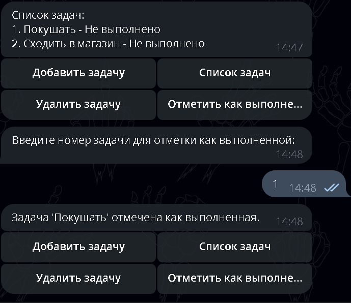

## ToDoListBot

### Запуск бота

Для запуска бота в Docker-контейнере вы можете следовать следующим шагам:

1. Убедитесь, что в вашем проекте присутствует файл `docker-compose.yml`, в котором определены сервисы и настройки контейнеров.

2. Проверьте, что у вас есть файл `.env` с необходимыми переменными окружения для конфигурации бота. Если у вас уже есть этот файл, вы можете перейти к следующему шагу. В противном случае, создайте файл `.env` и добавьте в него необходимые переменные окружения, например:

   ```shell 
   BOT_TOKEN=<ваш_токен_бота>
   DB_HOST=<хост_базы_данных>
   DB_NAME=<имя_базы_данных>
   DB_PORT=<порт_базы_данных>
   DB_USER=<пользователь_базы_данных>
   DB_PASSWORD=<пароль_базы_данных>v
   ```
   Замените <ваш_токен_бота> и другие значения переменных на соответствующие настройки вашего проекта.

4. Выполните следующую команду:
   ```shell
   docker-compose up --build
   ```
6. Docker будет собирать образы контейнеров, устанавливать зависимости и настраивать окружение в соответствии с указанными в Dockerfile и docker-compose.yml настройками. После успешного завершения сборки и запуска контейнеров, ваш бот должен быть доступен и готов к использованию.
   
   Обратите внимание, что перед запуском убедитесь, что Docker установлен и настроен правильно на вашей системе.
5. После запуска бота можете тестировать бота по [этой ссылке](https://t.me/ToDoListTzBot).

## Ниже показано как работает бот
### 1. Приветвие
   

### 2. Добавлеие задачи 
   

### 3. Список задач
   

### 4. Добавление новой задачи (Сделал так чтобы задачи были по порядку)
   

### 5. Отметить как выполненой (обращаетесь по индексу которая в списке)
   


### 6. Удаление задачи 
   

## 7. Список задач после удалений (если задача которая стояла выше удалена, то задачи которые ниже соритруются)
   
